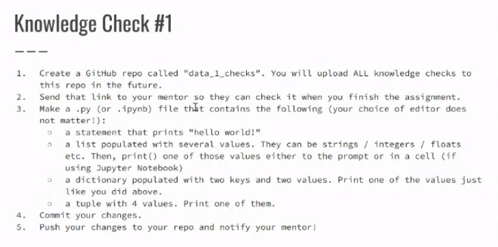
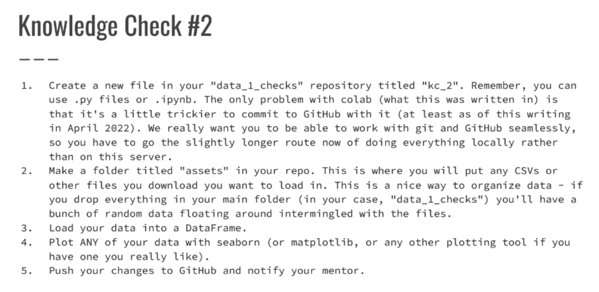
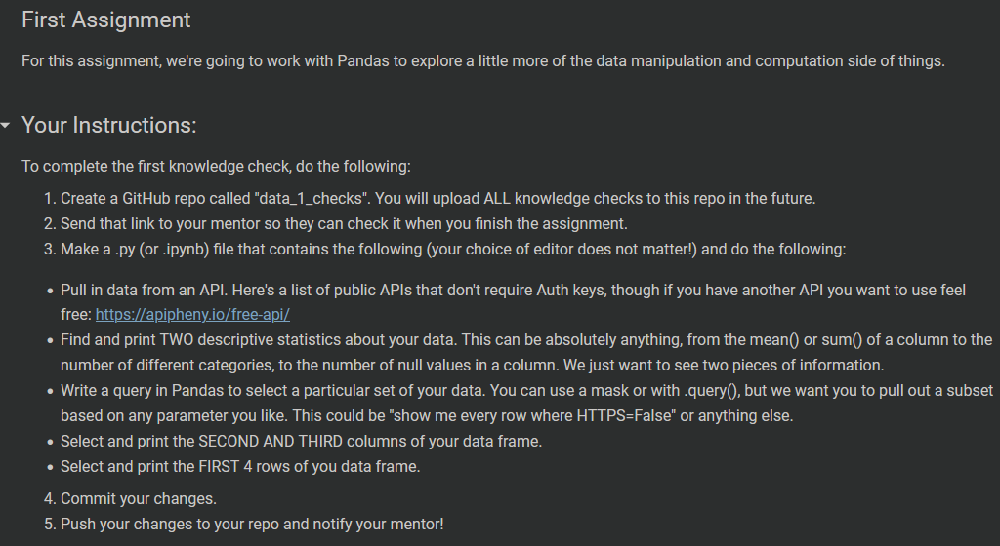

# Code Kentucky Data Analysis I Knowledge Checks

**Code and Resources Used**
 - Python 3.9
   - _Pandas_
   - _Matplotlib_
   - _Requests_
 - From the command line, input `pip install -r requirements.txt` from within the project directory to add required modules.
---

---
## License
[GNU GENERAL PUBLIC LICENSE](LICENSE)